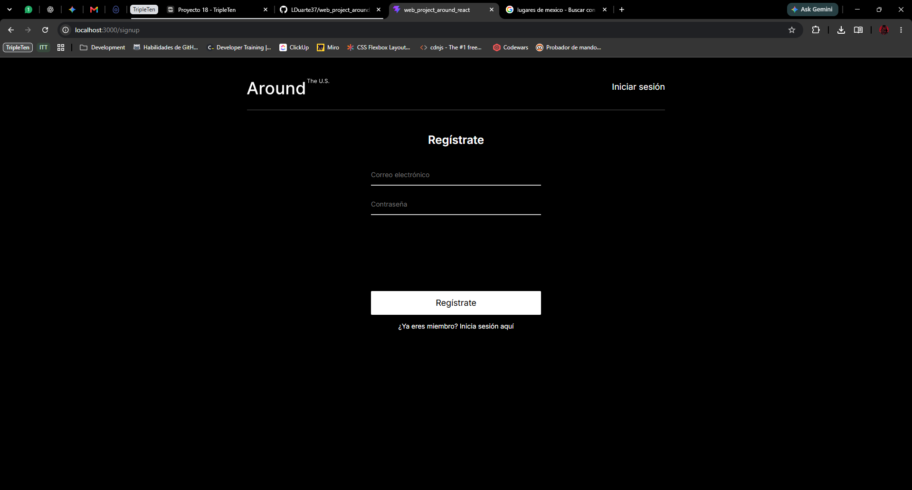
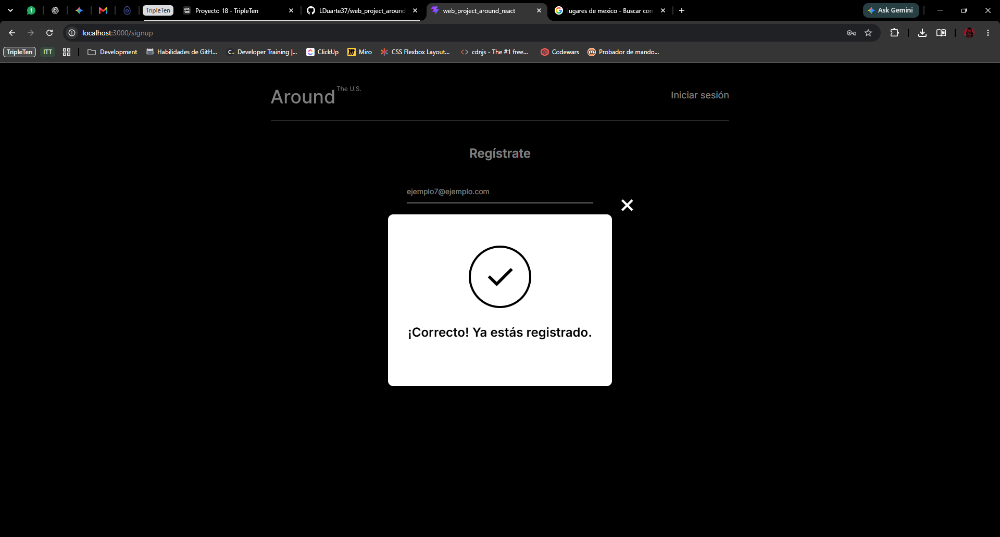
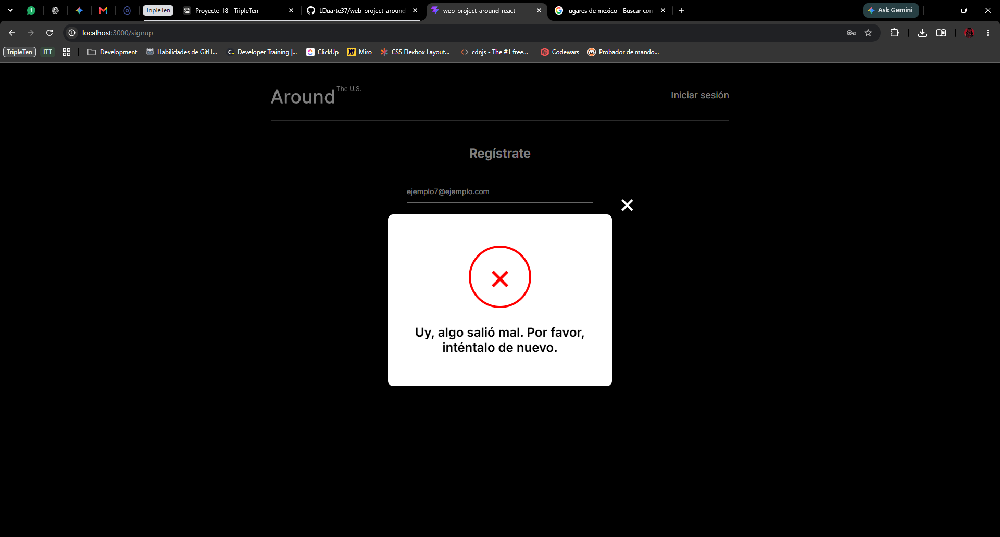
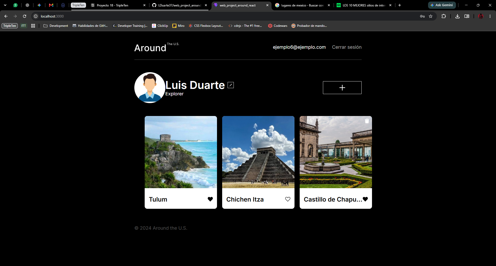

# Around the U.S. - Autenticación con React

## Descripción

Around the U.S. es una aplicación web desarrollada como parte del programa de Desarrollo Web de TripleTen.

En este proyecto se agregó un sistema de registro, inicio de sesión y autorización a la aplicación creada anteriormente con React. Los usuarios pueden registrarse, iniciar sesión y acceder al contenido principal únicamente cuando están autenticados.

La sesión se conserva utilizando un token JWT almacenado en `localStorage`.

## Funcionalidades

- Registro de nuevos usuarios.
- Inicio de sesión.
- Validación del token JWT.
- Persistencia de sesión mediante `localStorage`.
- Cierre de sesión.
- Protección de la ruta principal mediante `ProtectedRoute`.
- Redirección de usuarios no autorizados a `/signin`.
- Rutas para registro e inicio de sesión:
  - `/signup`
  - `/signin`
- Ventana `InfoTooltip` para mostrar el resultado del registro.
- Visualización y edición del perfil del usuario.
- Cambio de avatar.
- Visualización de tarjetas de lugares.
- Creación y eliminación de tarjetas.
- Likes en tarjetas.
- Apertura de imágenes en ventanas emergentes.
- Componentes reutilizables en React.

## Demo

Puedes ver la aplicación publicada en GitHub Pages:

https://lduarte37.github.io/web_project_around_auth/

## Tecnologías utilizadas

- HTML5
- CSS3
- JavaScript
- React
- React Router
- Vite
- Fetch API
- JWT
- Local Storage
- Git y GitHub
- Metodología BEM

## Instalación

Clona el repositorio:

```bash
git clone git@github.com:LDuarte37/web_project_around_auth.git
```

Entra en la carpeta del proyecto:

```bash
cd web_project_around_auth
```

Instala las dependencias:

```bash
npm install
```

## Ejecutar el proyecto

Para iniciar el servidor de desarrollo:

```bash
npm run dev
```

Después abre en el navegador la dirección que indique Vite.

## Comprobar el código

Para ejecutar ESLint:

```bash
npm run lint
```

## Compilar para producción

```bash
npm run build
```

## Capturas de pantalla

### Registro de usuario



### Registro exitoso



### Error de registro



### Inicio de sesión


### Usuario autenticado




## Autor

Luis Duarte